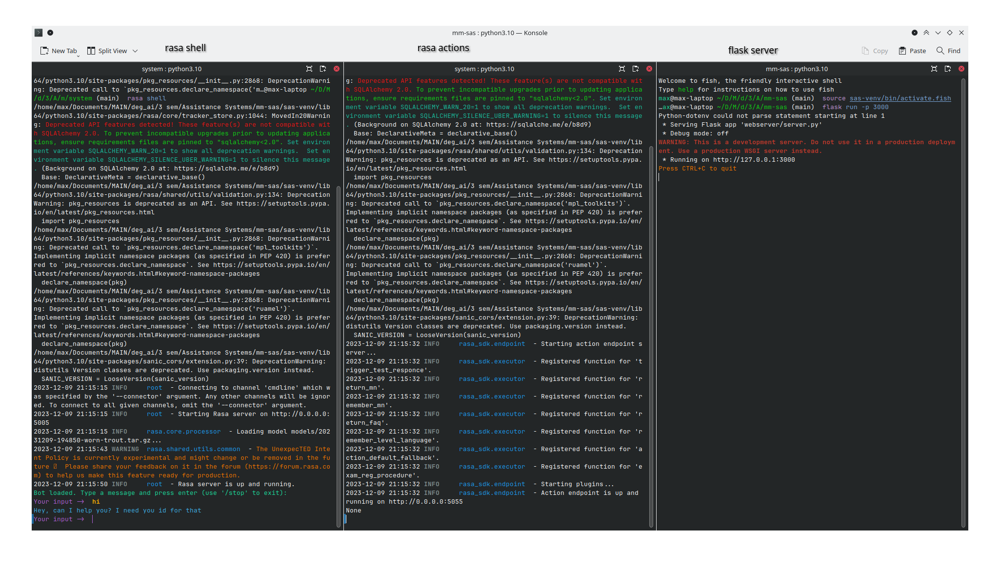
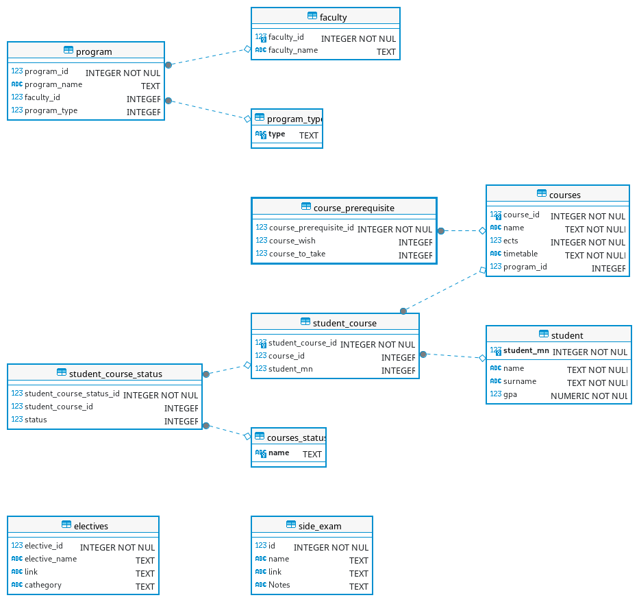

# 1. Rasa Chatbot "German Language Electives Assistant - Schoschka"

- [1. Rasa Chatbot "German Language Electives Assistant - Schoschka"](#1-rasa-chatbot-german-language-electives-assistant---schoschka)
  - [1.1. Authors](#11-authors)
  - [1.2. Project description](#12-project-description)
  - [1.3. Installation](#13-installation)
    - [1.3.1. Software version](#131-software-version)
    - [1.3.2. Installation steps](#132-installation-steps)
  - [1.4. Basic usage](#14-basic-usage)
  - [1.5. Implementation of the Requests](#15-implementation-of-the-requests)
    - [1.5.1. trigger\_test\_responce](#151-trigger_test_responce)
    - [1.5.2. remember\_mn](#152-remember_mn)
    - [1.5.3. return\_faq](#153-return_faq)
    - [1.5.4. remember\_level\_language](#154-remember_level_language)
    - [1.5.5. exam\_reg\_procedure](#155-exam_reg_procedure)
    - [1.5.6. action\_default\_fallback](#156-action_default_fallback)
    - [1.5.7. validate\_questionnaire\_form](#157-validate_questionnaire_form)
    - [1.5.8. give\_information\_for\_one\_elective](#158-give_information_for_one_elective)
    - [1.5.9. give\_list\_of\_electives](#159-give_list_of_electives)
  - [1.6. Architecture](#16-architecture)
    - [1.6.1. Rasa model](#161-rasa-model)
    - [1.6.2. Web Server](#162-web-server)
    - [1.6.3. Database](#163-database)
  - [1.7. Work done](#17-work-done)

## 1.1. Authors

Maxim Lapitan 22200839

Maxim Zotov 22200849

[Link to MyGit repo](https://mygit.th-deg.de/mz20849/mm-sas)

## 1.2. Project description

This Rasa chatbot can help international students to learn German language. One can:

- ask general questions,
- ask how to register to exams (one-site and exams like goethe)
- get additional information regarding rules

You can get more information about chatbot's scope in [respective wiki page](https://mygit.th-deg.de/mz20849/mm-sas/-/wikis/user-journeys)

Internal structure is covered in [here](#architecture)

See also [usage](#basic-usage) and [implementation of the requests](#implementation-of-the-requests)

## 1.3. Installation

### 1.3.1. Software version

Please note, that project uses following software versions:

| name        | version                                     |
| ----------- | ------------------------------------------- |
| python      | 3.10.13                                     |
| rasa        | 3.6.14                                      |
| kernel      | Linux-6.6.6-1-default-x86_64-with-glibc2.38 |
| flask       | 3.0.0                                       |
| tensorboard | 2.12.3                                      |

Version of subpackages can be seen in [requirements.txt](requirements.txt)

### 1.3.2. Installation steps

Installation should be proceeded in python venv. Steps are done in linux OS, but can be adapted to windows as well. Basically just git clone, create and activate venv (in console or in ide) and install required packages.

```bash
git clone https://mygit.th-deg.de/mz20849/mm-sas
cd mm-sas/
python3.10 -m venv sas-venv
source sas-venv/bin/activate
pip install -r requirements.txt
```

Eventually you may need [sqlite3](https://www.sqlite.org/index.html) installed, although it comes out of the box in linux.

Additionally sourcing `.env` file might be needed

- Linux

  ```bash
  source .env
  ```

- Windows

  ```powershell
  .\env.ps1
  ```

  or

  ```bat
  .env.bat
  ```

## 1.4. Basic usage

Usage consists of 4 parts (You may need several terminal windows for that):

1. Training rasa
2. Starting flask server
3. Running rasa actions
4. Activating rasa shell and working with trained model

Let's do it step by step.

1. Let's train model **(Window 1)**

   ```bash
   cd system
   rasa train
   ```

2. While rasa is doing it's training, let's start our **flask** webserver. There are 2 equal options **(Window 2)**

   1. ```bash
       cd mm-sas/
       flask run -p 3000
      ```

   2. ```bash
       cd mm-sas/webserver
       python3 server.py
      ```

3. Now let's activate rasa actions by running **(Window 3)**

   ```
   cd mm-sas/system
   rasa run actions
   ```

4. After model is trained, we can start rasa shell and input something in it. For this run **(Window 1)**

   ```bash
   rasa shell
   ```

Your setup may look like this



## 1.5. Implementation of the Requests

There are several rasa requests, which have to be extra processed. Therefore we have 12 slots and 8 entities together with 9 custom actions to produce user-tailored responces.

Additionally this rasa chatbot possesses a questionaire form.

There are 9 custom actions:

- [trigger_test_responce](#151-trigger_test_responce) - `ActionHelloWorld`, triggers test responce from REST server
- [remember_mn](#152-remember_mn) - `ActionRememberMN`, accesses the server and returns student (if he is available). Additionally sets slots `name`, `surname` and `gpa` using `return [SlotSet(key, value) for key, value in person.items() if key != "student_mn"]`
- [return_faq](#153-return_faq) - `ActionReturnFAQ`, returns link to faq, if user asks for frequent questions
- [remember_level_language](#154-remember_level_language) - `ActionRememberLL`, gets user's level of german and provides him with possible courses
- [exam_reg_procedure](#155-exam_reg_procedure) - `ActionExamRegistration`, returns instructions to register to goethe, telc and similar exams
- [action_default_fallback](#156-action_default_fallback) - `ActionDefaultFallback`, returns nothing, was added to prevent answering randomly to empty string inputs
- [validate_questionnaire_form](#157-validate_questionnaire_form) - `ValidateQuestionnaireForm`, responsible to validate questionnaire form while chatting
- [give_information_for_one_elective](#158-give_information_for_one_elective) - `GiveInformationForOneElective`, custom action to give information about one specific elective that user is interested in
- [give_list_of_electives](#159-give_list_of_electives) - `GiveListOfElectives`, custom action to give list of electives

### 1.5.1. trigger_test_responce

Part of the story

```yaml
- story: test_ping
    steps:
      - intent: trigger_test
      - action: trigger_test_responce
      - intent: goodbye
      - action: utter_goodbye
```

Will return *Success, the server is up and running, rasa is requesting as expected* if everything is fine. Else it will print "Error" and error message

Example:

> **Your input** -> test

> Success, the server is up and running, rasa is requesting as expected

### 1.5.2. remember_mn

Returns your matriculation number, GPA and name with surname (if exists), otherwise you will get some sort of error. Part of the story

```yaml
- story: identify student
    steps:
        - intent: greet
        - action: utter_ask_for_id
        - intent: say_matriculation
        - action: remember_mn
```

It also uses several slots (`student_mn`) is used to get information from database and others are "remembered" after request is completed.

```yaml
slots:
    student_mn:
        type: text
        mappings:
        - type: from_entity
            entity: matriculation_number
    name:
        type: text
        mappings:
        - type: custom
            action: remember_mn

    surname:
        type: text
        mappings:
        - type: custom
            action: remember_mn

    gpa:
        type: float
        mappings:
        - type: custom
            action: remember_mn
```

Example:

> **Your input** ->  hi

> Hi, can I have you id number please?

> **Your input** ->  22200849

> Hello Maxim Zotov, your id is 22200849 and gpa is 1

### 1.5.3. return_faq

when user wants to get access to all FAQ at once, he can request it.

```yaml
- story: get faq
    steps:
        - intent: get_faq
        - action: return_faq
```

`return_faq` will contact server to get link to most recent faq

Example:

> **Your input** -> faq

> <https://www.th-deg.de/Studierende/AWP-Sprachkurse/FAQ_EN.pdf>

### 1.5.4. remember_level_language

Part of story

```yaml
- story: identify student's level of language
    steps:
      - intent: want_learn_german
      - action: utter_ask_for_level_language
      - intent: say_level_language
      - action: remember_level_language
      - intent: ask_register_procedure
      - action: utter_register_procedure
```

When user wants to learn german, user gets asked about his level and then gets possible courses to attend. After that one can request registration instructions.

Example:

> **Your input** ->  I want to start lerning german

> Can I know your level of knowledge of german language?

> **Your input** ->  i have a1

> You can choose from several options:
>
> German A1/ part 1 + 2
>
> German A1/ part 3 + 4
>
> German A1/ Grammar and Vocabulary

> **Your input** ->  how to register

> Check your email. It should be an email from <julia.vollbrecht@th-deg.de>. Inside this email you will be able to find instructions of registration. Good luck!

### 1.5.5. exam_reg_procedure

Part of the story

```yaml
- story: german exam registration
    steps:
      - intent: want_german_exam
      - action: utter_which_exam
      - intent: say_german_exam
      - action: exam_reg_procedure
```

When one wants to pass german exam, system asks about type of the exam and then returns options how to register.

Example:

> **Your input** ->  How do I register for a German exam?

> Which one exam do you like do pass? Say me its name.

> **Your input** ->  goethe

> You selected goethe
>
> You can find additional information at <https://www.goethe.de/de/spr/kup/prf/prf.html>
>
> Note, that self registration without participation of DIT university

### 1.5.6. action_default_fallback

This was added primarily to stop model from responding to empty promts

Example:

> **Your input** ->

> I'm sorry, I didn't understand that. Can you please provide more information?

### 1.5.7. validate_questionnaire_form

Part of 2 stories:

```yaml
- story: Interactive Questionnaire 
    steps:
      - intent: ask_me_anything
      - action: questionnaire_form
      - active_loop: questionnaire_form
      - action: utter_ask_reason_to_study_in_germany
      - slot_was_set: 
        - requested_slot: reason_to_study_in_germany
      - action: utter_ask_language_about_question
      - slot_was_set:
        - requested_slot: language_about_question
      - action: utter_ask_mother_country
      - slot_was_set:
        - requested_slot: mother_country
      - action: questionnaire_form
      - active_loop: null
      - action: utter_submit
      - action: utter_questionnaire_slots
```

Asks for reasons to study in Germany and inquires about home country. Story begins when user wants to be asked.

His answers are anonymosly written to a database like this:

```sql
select * from questionnaire;
Reason Language_question mother_country
Career prospects Improving language proficiency Russian by birth
Career prospects Improving language proficiency Germany
Job Language improvement is a priority Russian by birth
```

Dialog flow may look like this:

> **Your input** ->Ask me anything

> Why did you want to study in Germany? What is the reason?

> **Your input** ->Job

> OK! You study here because Job
Do you know german language? Do you want to improve it while studying in Uni?

> **Your input** ->Language improvement is a priority

> OK! You think about the German language that: Language improvement is a priority
Where are you from? (Your country where you have born)

> **Your input** ->Russian by birth

> OK! You are from: Russian by birth
> Thank you for you responces. We have added them to our DataBase, but it is all anonymous
> Your answers for questionnaire are Job, Language improvement is a priority, Russian by birth

And this story helps to stop questionnaire form.

```yaml
- story: User interrupts the form and doesn't want to continue
    steps:
    - intent: ask_me_anything
    - action: questionnaire_form
    - active_loop: questionnaire_form
    - intent: Stop
    - action: utter_ask_continue
    - intent: Stop
    - action: action_deactivate_loop
    - active_loop: null
```

### 1.5.8. give_information_for_one_elective

Part of the story

```yaml
- story: Explore Elective Courses
    steps:
      - intent: ask_available_electives
      - action: utter_ask_for_type_of_elective
      - intent: say_type_of_elective
      - action: give_list_of_electives
      - intent: ask_for_information_about_one_elective
      - action: give_information_for_one_elective
      - intent: ask_how_to_register_for_one_elective
      - action: utter_register_procedure_one_elective
```

Gives one elective, in which student is interested.

### 1.5.9. give_list_of_electives

Same as [give_information_for_one_elective](#158-give_information_for_one_elective), but for list of electives. Used before in the same story.

The dialog flow with both custom actions may look like this:


> **Your input** ->What electives can I choose from?

> There are 3 types of electives: social, orientational_knowledge, german. Choose one.

> **Your input** ->social

> You can choose from several options:

> Achtsamkeitsbasierte Stressreduktion (MBSR)
>
> Bavarian Culture
>
> Personal and Professional Skills
>
> Communication & Rhetoric for Mentors
>
> Cross-Cultural Teambuilding Workshop
>
> Education 4.0 - Digital Innovation Units
>
> Volunteering
>
> Ethical Questions in international and intercultural Environments. Argumentation, Debate and Negotiations.
>
> Leadership Psychology
>
> Happiness - Wie Sie unvermeidlich glücklich werden
>
> Interkulturelle Kompetenzen
>
> Interkulturelle Sensibilisierung (Grundkurs)
>
> Interkulturelle Sensibilisierung - Länderspezifisch (Aufbaukurs)
>
> Intercultural Skills
>
> International Teambuilding
>
> Kommunikation und Rhetorik für Erstsemesterpaten und Mentoren
>
> Kompetenzen und Techniken der tutoriellen Betreuung
>
> Konflikt- und Teammanagement
>
> Medienkompetenz und Lernen in einer digitalen Gesellschaft
>
> MINT-Workshops mit Schüler:innen als Tutor:in
>
> Persönlichkeitskompetenzen für dual Studierende
>
> Problemlösungen in der Praxis
>
> Qualitative Research Methods
>
> Strategie - und Projektmanagement
>
> Welcome@DIT
>
> Wissenschaftliches Arbeiten und Schreiben – Erfolgreich und effizient in Studien-, Bachelor- und Masterarbeiten
>

> **Your input** ->Welcome@DIT

> You selected Welcome@DIT. Here is your link where you can find all information about this elective: 'https://www.th-deg.de/Studierende/AWP-Sprachkurse/kursbeschreibungen-awp/Welcome%40DIT.pdf'

> **Your input** ->What should I do to register for this elective?

> You need to write email to eva.toman@th-deg.de. Ask about Welcome@DIT

## 1.6. Architecture

Project consists of 3 parts:

1. **Rasa Model**: yaml files describing domain and actions file to communicate with webserver
2. **Web Server** (built using rest-api approach) to facilitate responces from rasa model
3. **Database**, to which server can connect and execute select commands.

### 1.6.1. Rasa model

Simple rasa model, built with 3 entities, 6 slots, 6 custom actions, more than 20 stories, almost 50 intents and 6 rules.

### 1.6.2. Web Server

REST-API python server, built using flask. Has several REST addresses, to issue GET requests (by now only GET is supported).

- `/test` - check if server is working and rasa actions functional
- `/languages/faq` - return link to frequently asked questions about the selection of language courses and electives (AWPs)
- `/student/<int:student_id>` - return student from a database. Print his gpa, name, surname and MN (if student is present)
- `/languages/levels/<ll_value>` - return available courses for each level (A1-C1)
- `/exams/<exam>` - get information about exams (goethe, telc, etc.)

### 1.6.3. Database

Database has the following structure:



Database can be used in variety of scenarios. It can be filled with students, their matriculation number, name, surname and GPA.

```sql
select * from student;
student_mn name surname gpa
10817623 Jack Perez 2.7
12399158 Yvonne Johnson 2.9
```

Table is also filled with all faculties and programmes, which were at DIT website.

```sql
select * from faculty JOIN program LIMIT 2;
faculty_id faculty_name program_id program_name faculty_id program_type
1 Civil and Construction Engineering 1 Civil and Construction Engineering  1 Bachelor
1 Civil and Construction Engineering 2 Construction Management  1 Bachelor
```

There is a table `programm_type`, which is responsible for holding programm types (Bachelor or Master).

Table `courses_status` holds values, which can be attached to `student_course_status` to control which student has which courses.

```sql
select * from courses_status;
name
attending
completed
retake
must_be_taken
```

`course_prerequisite` is used to specify which courses should be taken prior to attempting new one.

Table `side_exam` used to get information regarding german language exams (goethe, telc etc.).

## 1.7. Work done

The project is done by 2 students, we divide our work like this:

First student - Maxim Lapitan:

1. Personas
2. Example dialogs 
3. Implementation yml-files (domain, data/nlu)

Second student - Maxim Zotov:

4. Use cases 
5. Dialog flow 
6. Implementation yml-files (data/stories data/rules)

**Both** students:

7. Implementation actions.py (data/actions/actions.py)

Work was always carried out together without exceptions. We either sat together, or communicated via video chat and were implementing every task using 2 brains at the same time, thus reducing amount of human errors, because two eyes were looking at the project at the same time.
